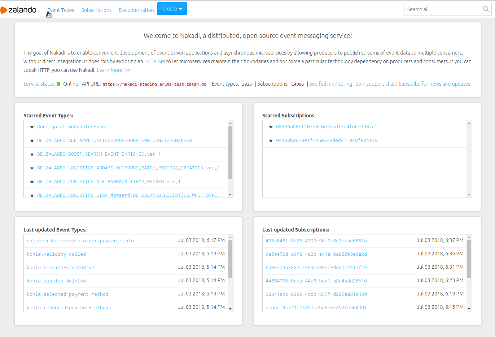

# Nakadi UI
A web-based graphical user interface to [Nakadi Event Broker](https://nakadi.io)

## Overview
Nakadi UI is a single page web application that uses the Nakadi API.
It provides a self-service user interface (SSUI) for event producers and consumers.
It makes it easy to create and configure event types (topics), discover and communicate event types
between developers, monitor and debug any problems with publishing or consuming events from Nakadi.
It consist of the [node.js](https://nodejs.org) backend and the frontend written in the  [Elm](http://elm-lang.org) language.

## Features
* Create, update, delete a Event Type
* List, filter and search registered Event Types
* Show detailed information about selected Event Type: Schemas, Partitions, Producers, Consumers etc
* Load list, search, show published events
* Create, delete a Subscription
* and more in [CHANGELOG.md](CHANGELOG.md)

## Screenshot


## Dependencies

### API
* [Nakadi](https://nakadi.io)
* [Scalyr](https://scalyr.com)
* Any identity provider supported by [Passport.js](http://passportjs.org/)
* App registry like [YOURTURN](http://docs.stups.io/en/latest/components/yourturn.html) (optional)

### Server
* [node.js](https://nodejs.org)
* [Express.js](https://expressjs.com)
* [Passport.js](http://passportjs.org/)

### Client
* [Elm](http://elm-lang.org)
* [Dress-code](https://zalando.github.io/dress-code/)
* [webpack](http://webpack.github.io/)

## Quick start
Use [docker-compose](https://docs.docker.com/compose/) to play with Nakadi and Nakadi UI locally.

```
docker-compose up
```

and then login to http://localhost:3000/

*Security Warning: Nakadi and Nakadi UI authentication is disabled.*

## Installation
See [INSTALL.md](INSTALL.md)

You can also use [the docker image](https://hub.docker.com/r/nakadi/nakadi-ui/).


# Development & Contributing

Contributions are welcome! See [CONTRIBUTING.md](CONTRIBUTING.md)

## Contact
See [MAINTAINERS](MAINTAINERS)

## License
The MIT License ([MIT](LICENSE))

Copyright 2016 Zalando SE

The Nakadi UI is released under the MIT license. See [LICENSE](LICENSE) for details.

Unless required by applicable law or agreed to in writing, software distributed
under the License is distributed on an "AS IS" BASIS, WITHOUT WARRANTIES OR
CONDITIONS OF ANY KIND, either express or implied. See the License for the specific
language governing permissions and limitations under the License.
