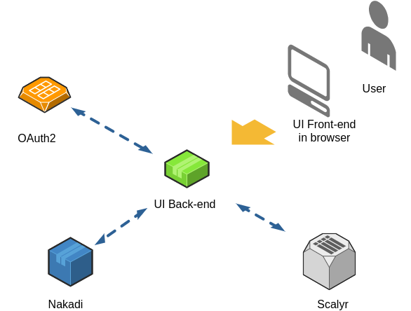

# Nakadi UI
A web-based graphical user interface to [Nakadi Event Broker](https://nakadi.io)

## Overview
Nakadi UI is a single page web application that uses the Nakadi API.
It provides a self-service user interface (SSUI) for event producers and consumers.
It makes it easy to create and configure event types (topics), discover and communicate event types
between developers, monitor and debug any problems with publishing or consuming events from Nakadi.

## Architecture

Nakadi UI consists of the [node.js](https://nodejs.org) back-end and
the single page application (SPA) front-end written in the [Elm](http://elm-lang.org) language.

 

### Directory structure

Source directories stored in Git:
- client - Contains source files for the front-end SPA.
- docs - The project documentation. It will be published to GitHub pages.
- server - Contains back-end server source files.
- tests - Contains server unit tests, server API tests, and end-to-end (selenium) tests.

Other folders could be dynamically created by various tasks.
- deploy - The secrets needed for deployment and development (ie certs, auth keys etc).
- dist - The built front-end SPA. Will be the root of the static website.
- reports - Build reports, test results, and tests coverage reports.
- elm-stuff - Cached Elm modules and Elm build cache;
- node_modules - Node.js modules.


### Back-end

The back-end is mostly a proxy which abstracts the front-end from all connected services
(Nakadi, Identity Providers, Logs services, etc).
It provides:
 - web server - to serve static content like HTML, JS, CSS, and images.
 - REST API - the only API used by SPA.

The server runs on Node.js. It is written in pure JavaScript using some features of ECMAScript 6.

It uses only CommonJS and does not use the ECMAScript 6 modules system because it dynamically loads modules (plugins)
based on runtime configuration (environment variables).
When node.js implements [import()  function](https://blog.hospodarets.com/native-ecmascript-modules-dynamic-import),
it will be possible to use only ECMAScript 6.

The back-end server is based on the [Express](https://expressjs.com/) framework and follows a classical architecture.

#### Directory structure

The back-end server consists of:
- Server runner (server.js) - Loads configuration, instantiates the main application, and runs it.
- Configuration loader (config.js) - Loads configuration from environment variables to config object.
- Main application (App.js) - Connects request handlers and sub-routers to main router.
  - logger.js - Setup general logger and sets the access log handler.
  - staticFiles.js - Serves static content in production mode. In development mode, it uses the webpack hot reload feature.
  - auth.js - Handlers and end-points related to user authentication.
  - logsApi.js - End-points to statistics extraction from access logs stored in the Scalyr service.
  - nakadiApi.js - End-point to proxy requests from UI to Nakadi API back-end.


### Front-end

The front-end is a static single page application written mostly in [Elm](http://elm-lang.org/)
using the [dress-code](http://zalando.github.io/dress-code/) CSS framework.

The code structure follows [The Elm Architecture](https://guide.elm-lang.org/architecture/) with the root modules
Model, Update, View.

#### Directory structure

In the client source root we have:
- main modules:
    - index.js - The bootstrap for Elm.
    - Main.elm - the main app joins together the initial model state, the update function, and the main view.
    - Models.elm - Describes and initiates the main application model.
    - Update.elm - Contains main update function that routes each message to an update function of of the
    appropriate sub-module, and is also responsible for cross-module communication.
    - View.elm - The main root view function of the application.
     It creates an HTML representation of the current state of the model.
    - Messages.elm - Describes the main message type that includes all sub-messages.

- additional helper modules:
    - Config.elm - contains static configuration constants.
    - Constants.elm - contains global constants that should not be modified, mostly aliases for common strings like field names.
    - Types.elm - frequently used type aliases.

The folder structure:
- assets - static files like CSS, images etc.
- Helpers - components and libraries used in several modules or logically independent.
- MultiSearch - the multi-search component used in the application header or on the "Create Subscription" page.
- Native - connects JavaScript Native Browser API to Elm.
- Pages - contains the list of directories. Each directory here represents one logical page and contains
the page View module and optionally the Model (page state) module and the Update module.
- Routing - implements high-level URL routing, reacts to URL changes and transforms the URL to a new model state and a new view.
- Stores - implements various data stores that abstracts API calls and stores the API call results.
- User - contains user authentication components and the user login state.
- Tests - contains Elm unit tests.

#### URL Routing

The Nakadi URL looks like this
```
https://nakadi.int/#types/bazar.updater-refeed/partitions/0?offset=BEGIN&page=0&selected=001-0001-000000000000000427&size=1000
```
where:
 - `https://nakadi.int/`- is the base URL
 - `#types/bazar.updater-refeed/partitions/0` - the page URL
 - `?offset=BEGIN&page=0&selected=001-0001-000000000000000427&size=1000` - the page state

##### URL to Model

 When the user changes the URL by editing the browser URL or clicking a link, the app receives the message `OnLocationChange`.
 The message will then be routed to the Routing module. Then we split the URL to a list of path elements and query
 parameters, and then Routing tries to find a match between this path and any element in `routingConfig`. If a match found,
 the routing runs the corresponding function that translates the path and the query into the new value of type Route.
 This new route will be stored in the model and will be used later to choose the view to show, and to route messages
 only to the displayed page. This new route also passed to the page itself by `OnRouteChange` message,
 so the page can update its model state.

 *Note:* There is a problem with evancz/url-parser ([issue](https://github.com/evancz/url-parser/issues/27)), so we had to
 re-implement the location parser.

##### Model to URL

 When the user changes the page state (like changing input fields), then the page translate its new state
 to a new Route and send it back to the main update function as a third parameter. In the end of update function, this
 new route will be compared with the current route. If it differs, the `SetLocation` message will be dispatched,
 and then the routing will use `Browser.pushState` if path has changed, or `Browser.replaceState` if only the query
 parameters were changed.

 *Note:* The reason we can't use elm-lang/navigation package is the [issue](https://github.com/elm-lang/navigation/issues/35#issuecomment-311063566)
 with the fire-back messages when an application changes the location inside.


Internally all routes inside application are represented as a type Route, which is used to generate all internal links.
It helps to check for "broken links" during the compilation stage.
The Route type can include UrlParam and UrlQuery types specific to this page.

It looks like this:

`EventTypeDetailsRoute EventTypeDetails.UrlParams EventTypeDetails.UrlQuery`

This also guarantees that all URL parameters or Query parameters will always be valid.

To translate a URL to a Route, a page can have functions in the Model module like:

`dictToParams` - Converts the dictionary of params parsed from the URL path to the UrlParams type.

`dictToQuery` - reads the dictionary of strings parsed from URL and convert them to the Query type.

`queryToUrl` - the opposite transformation from the page specific Query type to URL string.

#### Data Stores

The idea behind data stores is to abstract all remote API calls or local browser API storage so that a page
only accesses data from the store, without implementing all HTTP calls and all error handling.

All stores are based on the abstract `Helpers.Store`. It implements its own `update` function and the model
that stores response as an abstract dictionary of `entities`, the store state, and the error message if the API call
was unsuccessful.
To create the implementation of the store, you need to provide the concrete entity, for example
```elm
type alias Model =
    Helpers.Store.Model EventType
```

and the configuration object like

```elm
config : Dict.Dict String String -> Helpers.Store.Config EventType
config params =
       { getKey = (\index eventType -> eventType.name)
       , url = Config.urlNakadiApi ++ "event-types"
       , decoder = collectionDecoder
       , headers = []
       }

```

where :
- getKey - function that returns a unique key for each item in the store.
- url - the endpoint for HTTP API call.
- decoder -  JSON to Entity [decoder](http://package.elm-lang.org/packages/elm-lang/core/5.1.1/Json-Decode).
- headers - optional headers.

Please look at examples in [Stores folder](https://github.com/zalando-incubator/nakadi-ui/tree/master/client/Stores).

Then you can include the store model in any page model, or in the root model level, if it is used in several pages.


